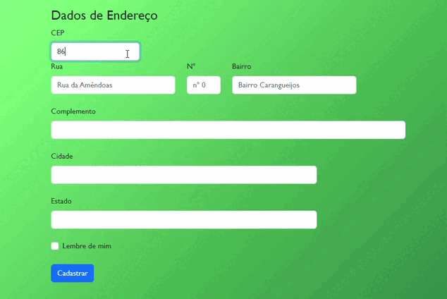

 

# **Formulário de Cadastro de Endereço**

## **Introdução**

O WebSite consiste em localizar o endereço por meio do CEP incerido pelo usuário. Ele lê o CEP digitado e conecta ele ao site do **ViaCEP**, realizando uma troca de dados, que responde inserindo a Rua, Bairro, Cidade e Estado para o usuário. Siga a explicação de alguns métodos utilizados.

 

## **Explicações de códigos JavaScript**

* ***use strict*** | *Modo restrito:* Este modo faz com que o JavaScript opere de forma mais segura e rigorosa, ajudando a evitar erros comuns de programação.

* ***const*** | é usada para declarar uma variável constante, ou seja, um valor fixo que não pode ser alterado ou reatribuído durante a execução do programa. 

* ***length*** | propriedade que verifica quantidade de caracteres dentro de um argumento.

* ***value*** | Adiciona um valor uma elemento.

* ***document.getElementById('').value = '';*** | O ***getElementById()*** método da ***Document*** interface retorna um ***Element***objeto que representa o elemento cuja ***id*** propriedade corresponde à string especificada. Como os IDs de elementos precisam ser exclusivos se especificados, eles são uma maneira útil de obter acesso a um elemento específico rapidamente.

* ***async*** | A declaração **async function** define uma função assíncrona, que retorna um objeto 

* ***AsyncFunction***. Programação assíncrona é uma técnica que permite que seu programa inicie uma tarefa potencialmente de longa duração e ainda seja capaz de responder a outros eventos enquanto essa tarefa é executada, em vez de ter que esperar até que essa tarefa seja concluída.

* ***await*** | O operador **await** é utilizado para esperar por uma **Promise**. Ele pode ser usado apenas dentro de uma **async function**.

* ***fetch*** | A **API Fetch** fornece uma interface JavaScript para acessar e manipular partes do pipeline HTTP, tais como os pedidos e respostas. Ela também fornece o método global **fetch()** que fornece uma maneira fácil e lógica para buscar recursos de forma assíncrona através da rede.

* ***json*** | **JSON** é frequentemente usado quando dados são enviados de um servidor para uma página da web.

* ***addres*** | O objeto Address representa um elemento HTML **address**.

* ***hasOwnProperty()*** | O **hasOwnProperty()** método de **Object** instâncias retorna um booleano indicando se este objeto tem a propriedade especificada como sua própria propriedade (em oposição a herdá-la).

* ***alert*** | Como o próprio nome já diz, ele apresenta um alert (Pop-Up de Alerta), que deve ser configurado

* ***ddEventListener()*** | O **addEventListener()** método da EventTargetinterface configura uma função que será chamada sempre que o evento especificado for entregue ao alvo.

 

## **Códigos em partes**

***const eNumero = (numero) => /^[0-9]+$/.test(numero);*** | Cria regra de expressão regular (Regex) para testar valor informado pelo usuário. Essa parte do código, verifica se há so números entre 0 a 9 no campo CEP.

***const cepValido = (cep) => cep.length == 8 && eNumero(cep);*** | Valida a quantidade de números digitados no campo CEP que possui  8 números.

***const url = `https://viacep.com.br/ws/${cep.value}/json/`;*** | Aqui adicionamos uma ***URL*** em que o projeto utiliza os dados disponibilizados por esse site, fazendo uma conexão.

## **Interface**

## **Tecnologias**
 

 
   
   
   
   
   
   
 
   
   
   

 

## ***Referência***

* [Alura](https://www.alura.com.br/)
* [W3Schools](https://www.w3schools.com/)
* [MDN Web Docs](https://developer.mozilla.org/en-US/docs/Web)

## **Site utilizado para o consumo de API**
 
   
          
 

 

## **Link do Site criado nesta aplicação**

[Cadastro de Endereço](https://emillybonfim.github.io/form-CadEndereco/cadastro.html)

##
 
## **Quer me conhecer?**
 
 

   
   
    

